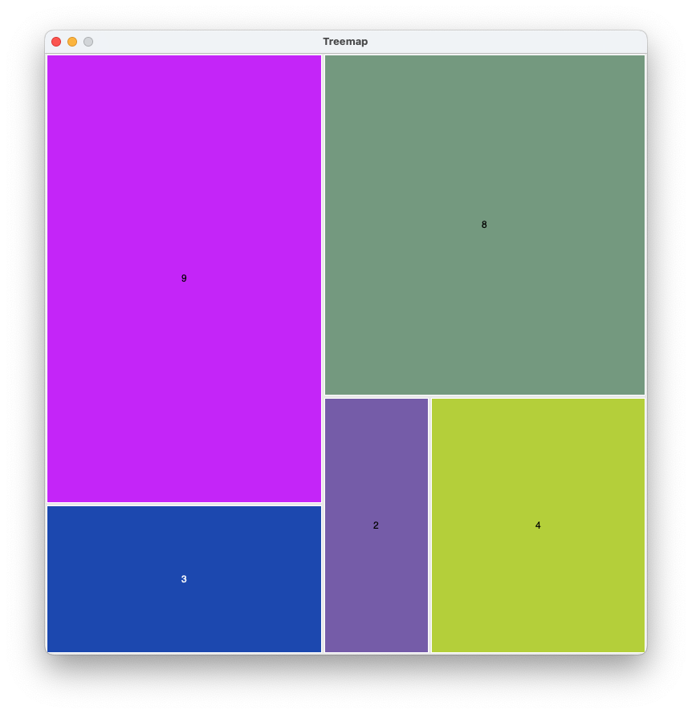

# Example data for treemapping

The contents of this directory are example data files for the 
treemapping project, all in JSON (Javascript Object Notation) format. 

## Flat lists of integers

- `small_flat.json` : This is the data set used for the small 
  illustration near the beginning of the project HOWTO document. 
  It is a single "flat" list of integers `[3, 9, 2, 4, 8]`.
  It should produce a diagram that looks like this (but with random 
  colors): 

  

- `medium_flat.json`  :  A slightly longer flat list of integers
   used in the HOWTO document to show why horizontal or alternating
   slices without balance ("squarifying") are unsatisfactory. It 
  should produce a diagram roughly like this, with varying colors: 

  

