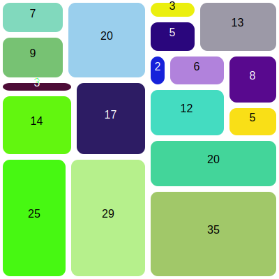

# Example data for treemapping

The contents of this directory are example data files for the 
treemapping project, all in JSON (Javascript Object Notation) format. 

## Flat lists of integers

- `small_flat.json` : This is the data set used for the small 
  illustration near the beginning of the project HOWTO document. 
  It is a single "flat" list of integers `[3, 9, 2, 4, 8]`.
  It should produce a diagram that looks like this (but with random 
  colors): 

  

- `medium_flat.json`  :  A slightly longer flat list of integers
   used in the HOWTO document to show why horizontal or alternating
   slices without balance ("squarifying") are unsatisfactory. It 
  should produce a diagram roughly like this, with varying colors: 

  

## Nested lists of integers

- `small_nested_list.json` : The smallest example of
  data organized as nested lists of integers. It is
  just two levels, `[3, [9, 2], 4, 8]`.

- `medium_nested_list.json` : A slightly larger example
  of data represented as nested lists of integers. 
  `[ [7, 9],
  20, 3,  14, 17, 25, 29, 3, 5, 13,
  [[2, 6], 12],
  [8, 5],
  20, 35 ]`. 

## Categorical data as nested dictionaries

- `attendance_cost.json`:  An alarming estimate of costs for a 
  resident (in-state) student attending a public university
  and living in campus housing (dorms), taken 
  from information published by the university in 2024. 
  `{
  "University Charges": {
  "Tuition": 15669,
  "Housing": 15840
  },
  "Books": 1320,
  "Personal": 2460,
  "Transportation": 432
}`

- `majors-23F.json`: Distribution of declared majors among students 
  in a CS-1 course at a public comprehensive university. 
  Much larger and busier than `attendeance_cost.json`. Labels are 
  major codes, which are more compact than names of majors but 
  probably meaningless to anyone outside that university.

