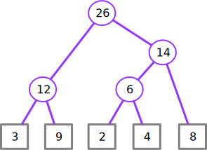
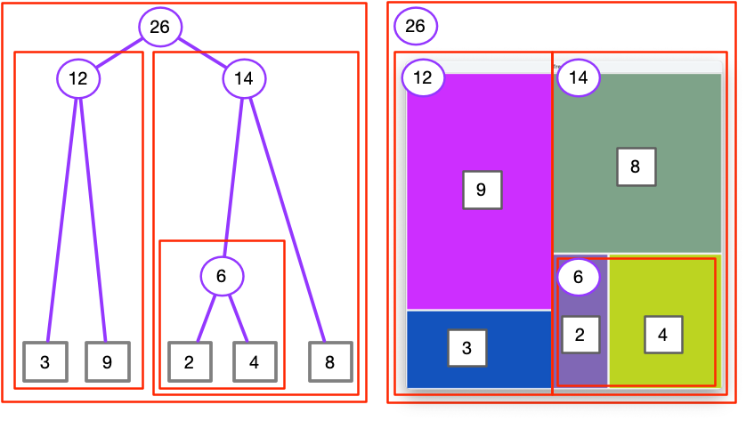
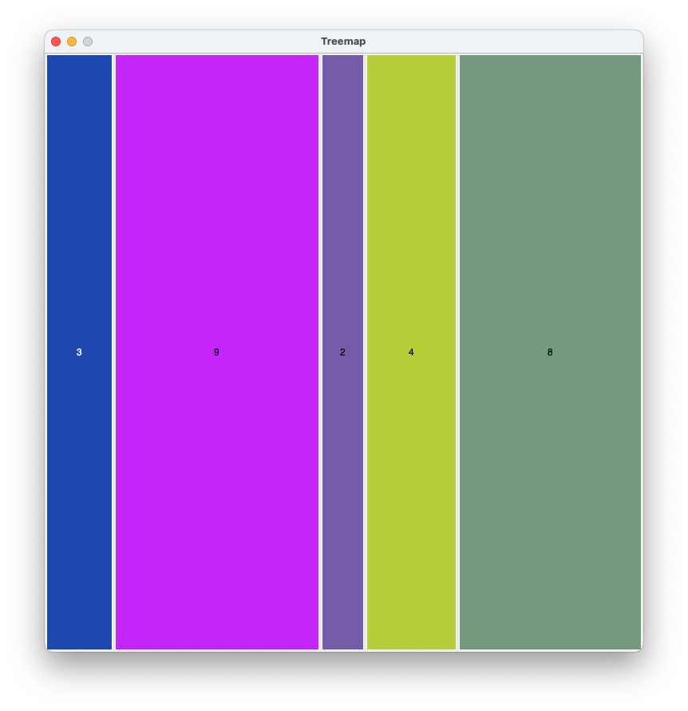
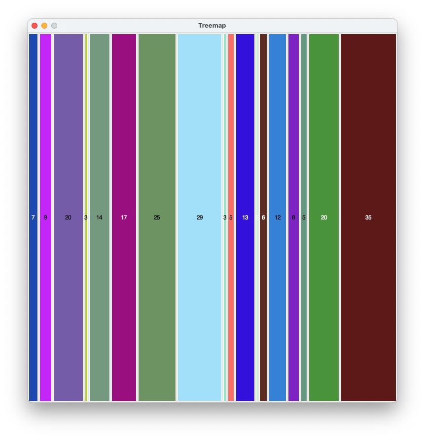
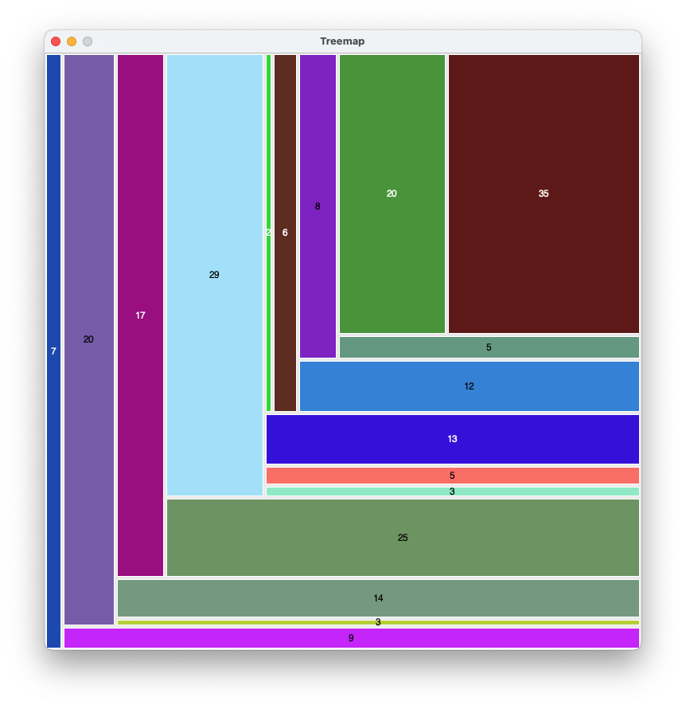
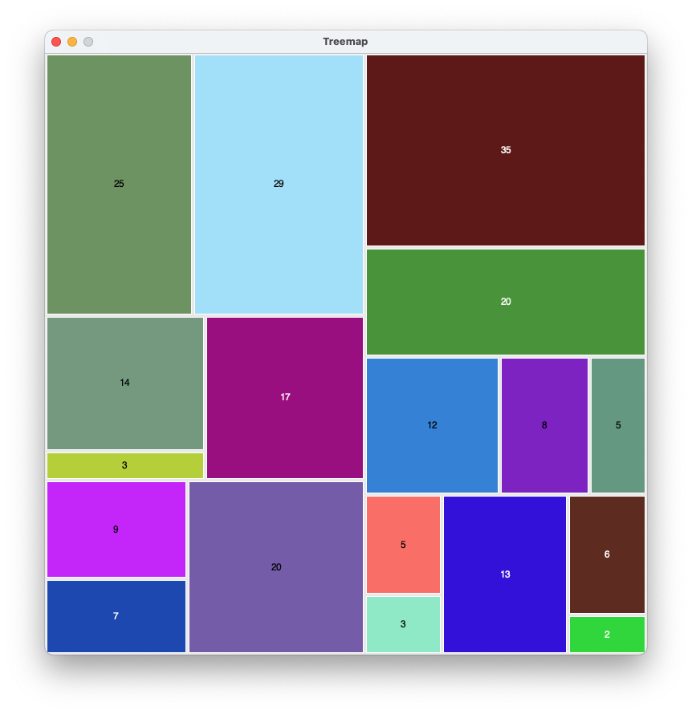
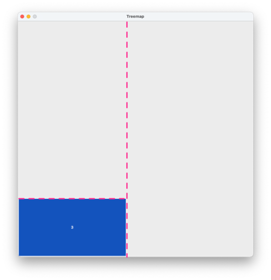
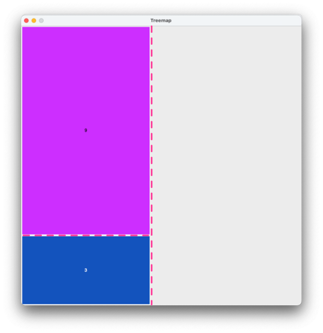
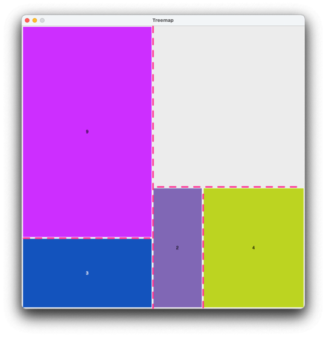
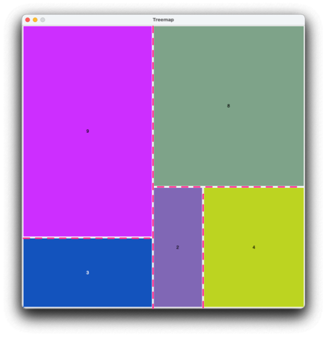

# HOWTO build a treemap

A [_treemap_](https://en.wikipedia.org/wiki/Treemapping)
is a diagram that represents a collection of values by 
proportionally-sized tiles.  For example, given the values
`[3, 9, 2, 4, 8]`, we might produce the diagram 

![Treemap of \[3, 9, 2, 4, 8\]](img/step-4.png)

There are many variations on treemapping, but all are fundamentally 
built on recursively subdividing a collection of values while also 
subdividing the space to be tiled.  The layout corresponds to a 
_tree_ of values. 



In the tree diagram, we can see the values to be tiled as leaves of 
the tree (represented as rectangles) with the individual values 3, 9,
2, 4, and 8.  Groups of nodes (which will be represented by groups 
of tiles) are represented by circles containing sums of tiles in 
each group.   Values 3 and 9 are grouped under a node 12 (3 + 9), 
2 and 4 grouped under 6, and 8 with the subgroup of 2 and 4 with
sum 14.  Finally, at the root of the tree, the value 26 represents 
subgroups with sums 12 and 14, which together include all the
values. The tile or group of tiles represented by each node is 
drawn in a size proportional to the value in the tree node 
representing that tile or group.  



## Squarer is better

There are many ways we could divide a rectangle into tiles.  For 
example, we could simply slice it up either vertically or 
horizontally. 



If we always slice the same way, we get long skinny tiles.  With a 
larger number of tiles, this becomes less and less useful. 



Slicing either horizontally or vertically can provide an aspect 
ratio (ratio of height to width) closer to 1.0, but is still not good. 



To do better, we need to divide the list of values into
better subgroups.  To "squarify" the tiles, we can repeatedly
subdivide the collection of values into groups that are as close as 
possible to equal in total. 



## Balanced splits

We will provide better, more "squarified" treemaps by dividing each 
list of values at a point that minimizes the difference between the 
sum of the two parts.   This will not always be the middle of the 
list.  For example, suppose we want to divide the list
`[1, 1, 1, 1, 1, 5]` into two parts.  If we divided into `[1, 1, 1]`
and `[1, 1, 5]`, the sums would be 3 and 7.  Dividing into
`[1, 1, 1, 1, 1]` and `[5]` gives more balanced sums of 5 and 5.

### Example

Consider laying out a tiled diagram for `[3, 9, 2, 4, 8]` in a
square canvas, 750 by 750 units.  

The sum of values in `[3, 9, 2, 4, 8]` is 26, so we would like to 
divide it as close to possible to 13 + 13.  An exact split is not 
possible, but we can divide it into `[3, 9]` and
`[2, 4, 8]` (12 + 14).   We can make a corresponding division of the 
750 by 750 unit canvas into 346 by 750 (12/26 of the original 750 
unit width) and 
404 by 750 (14/26 of the original).  We will tile `[3, 9]` in the 
former and `[2, 4, 8]` in the latter. 

To lay out tiles for `[3, 9]` in the smaller of the two parts of the 
canvas, we again bisect it, in the only way possible as `[3]` and 
`[9]`.  The 346 by 750 region of the canvas is divided proportionally,
producing a 346 by 187 rectangle for `[3]`



Similarly, `[9]` is placed in a 346 by 563 rectangle in the remaining 
part of the 346 by 750 region. 



It remains to lay out `[2, 4, 8]` in the right side of the canvas.  
We bisect `[2, 4, 8]` into `[2, 4]` and `[8]`, (totals 6 and 8) and 
make a corresponding division of the canvas region.  `[2, 4]` is 
then bisected into `[2]` and `[4]`, again making corresponding 
divisions of the canvas region.  (Regions are split vertically if 
they are taller than they are wide, and horizontally otherwise.)



This leaves just `[8]`, which is placed in the remaining portion of 
the canvas. 



## Geometry

I have provided a module `geometry.py` with `Point` and `Rect` 
(rectangle) classes.  A rectangle is defined by its lower left and 
upper right corners, in integer coordinates.  `Rect` provides a 
method `split` that returns two sub-rectangles in some proportion.  
For example, if we want the regions to be proportional to parts of a 
list, we might write 

```python
    proportion = sum(left) / sum(li)
    left_rect, right_rect = rect.split(proportion)
```

## Bisecting lists 

You will need to write a 
bisection 
routine that 
takes a list of two 
or more positive integers and returns two sublists which together 
comprise the original list: 

```python
def bisect(li: list[int]) -> tuple[list[int], list[int]]:
    """Returns (prefix, suffix) such that prefix+suffix == li
    and abs(sum(prefix) - sum(suffix)) is minimal.
    li must be a list of two or more positive integers.
    """
    assert len(li) >= 2, f"Cannot bisect {li}; length must be at least 2"
```

A set of unit test cases for the bisection function is provided in 
`test_splitter.py`.  


### FIXME
If CS 210, move test cases into doctest


